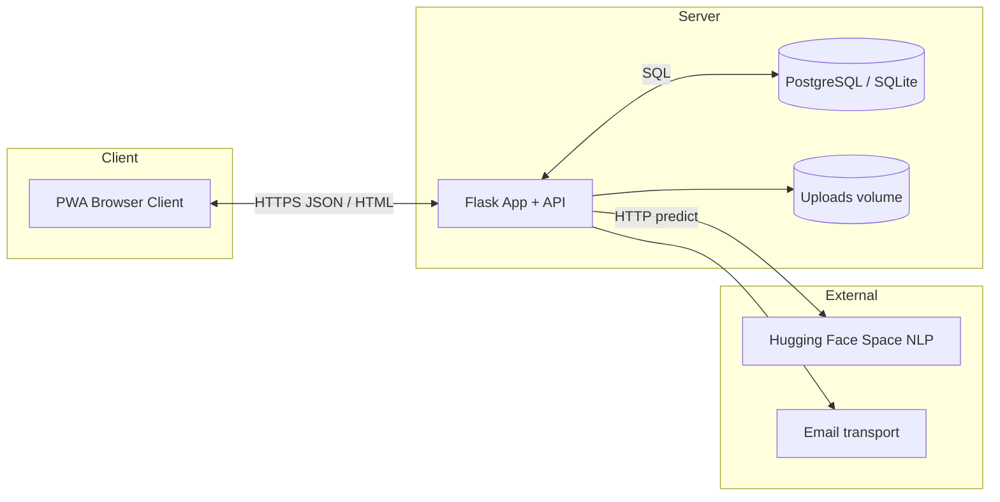
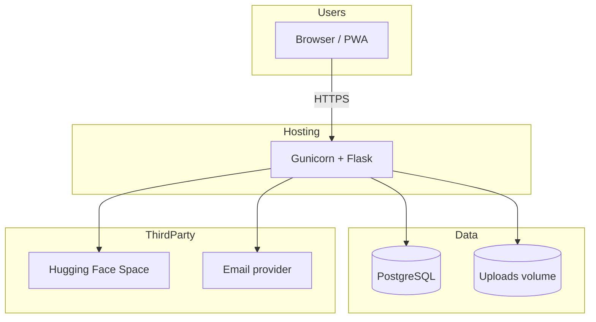

# DiariCore — Chapters 1 to 3  
*(Capstone / thesis-style documentation aligned with the implemented system)*  

**Document version:** 1.0  
**System:** DiariCore — personal journaling web application with mood analysis, security features, and PWA support  

---

# Chapter 1 — Project and Its Background  

## Introduction  

DiariCore is a **web-based personal journaling system** designed to help users capture daily thoughts, organize entries with tags and media, and receive **machine-assisted emotional pattern insights** from their own writing. The application is implemented as a **single-page–style experience** delivered through server-hosted **HTML, CSS, and client-side JavaScript**, backed by a **REST-style JSON API** built with **Python Flask**.  

The system targets users who want a **private, account-based** space for reflection while benefiting from **optional AI-assisted mood labeling** (e.g., happy, sad, anxious, angry, neutral) derived from journal text. Recent enhancements include **registration privacy notice and consent** aligned with the **Data Privacy Act of 2012 (Republic Act No. 10173)** of the Philippines, with consent timestamps stored in the database.  

Deployment is oriented toward **cloud hosting** (e.g., Railway) with **PostgreSQL** in production and **SQLite** for local development, plus a **Progressive Web App (PWA)** layer (manifest, service worker) for installability and offline-tolerant static assets.  

## Project Context  

Many people already use notes apps or social platforms for expression, but those tools often **lack journaling-specific workflows**, **consistent mood tracking tied to entries**, or **clear privacy framing** for sensitive reflections. In the Philippine context, **RA 10173** requires transparent handling of personal and sensitive personal information; journal content and inferred emotional states qualify as **high-sensitivity data** that must be handled with explicit consent and strong security practices.  

DiariCore was developed as a **capstone-level software project** to demonstrate integration of:  

- Secure **authentication** (sessions, password policies, optional **TOTP** two-factor authentication, recovery flows).  
- **Email-based verification** for new accounts (OTP) and related account flows.  
- **AI/ML inference** for emotion classification via an external **Hugging Face Space** API (with **keyword fallback** when the service is unavailable).  
- **Web Push** reminders using **VAPID** (no third-party push vendor required).  
- **Cross-device sync** patterns (API endpoints for sync state and streaming where applicable).  
- **Progressive Web App** behavior for mobile and desktop browsers.  

## Project Purpose  

The purpose of DiariCore is to **provide a dedicated journaling platform** that:  

1. Lets users **write, edit, delete, and browse** journal entries with metadata (title, datetime, tags, optional images).  
2. Applies **emotion and sentiment analysis** to support self-reflection dashboards and insights—not clinical diagnosis.  
3. Upholds **security and privacy** through consent, validation, rate limiting, CSRF-aware session POSTs, and configurable production hardening (e.g., secure cookies behind HTTPS).  
4. Remains **accessible on modern browsers** and **installable as a PWA**, including reminder notifications where supported.  

## Beneficiary  

**Primary beneficiaries**  

- **End users (journalers)** seeking a structured, private tool for reflection, mood awareness, and habit-building (e.g., daily reminders).  
- **Students / developers** documenting a full-stack capstone: Flask API, database design, frontend integration, DevOps-style deployment, and responsible AI use.  

**Secondary beneficiaries**  

- **Instructors and evaluators** assessing software engineering, security, and compliance literacy.  
- **Future maintainers** who inherit a modular codebase (`app.py`, `db.py`, `space_nlp.py`, `push_service.py`, static clients).  

## Project Objectives  

### General Objectives  

To design, implement, and evaluate **DiariCore**, an integrated web application that combines **secure user management**, **journal entry management**, **AI-assisted mood analysis**, **insights and tagging**, **PWA delivery**, and **optional push notifications**, while documenting architecture, data flows, and limitations suitable for capstone-level assessment.  

### Specific Objectives  

1. **User authentication and account lifecycle**  
   - Implement registration with **client- and server-side validation**, **username/email availability checks**, **email OTP verification**, and **privacy consent** with `privacy_agreed_at` persisted through pending registration into the `users` table.  
   - Implement login, logout, session handling, password reset, profile updates, and **TOTP** setup/disable with recovery options.  

2. **Journal management**  
   - Support CRUD operations on entries via JSON API (`GET/POST/PATCH/DELETE` entries).  
   - Support **image uploads** stored under a configurable uploads directory with safe path handling.  
   - Enforce **input limits** (e.g., entry word caps via environment configuration).  

3. **Emotion / sentiment analysis pipeline**  
   - Integrate **Hugging Face Space** inference over HTTP (`httpx`) with validated JSON responses.  
   - Provide **deterministic fallback** classification when the Space is down or times out.  
   - Expose analysis to the client through dedicated API routes (e.g., analyze text for preview, analyze on save where implemented).  

4. **Insights and personalization**  
   - Generate **template-based insights** (e.g., stress/happiness triggers, keyword-linked narratives) from stored entry statistics.  
   - Support **user tags**, **avatars**, and **UI preferences** (theme/palette) persisted per user.  

5. **Security and compliance awareness**  
   - Apply **rate limiting** and **CSRF validation** on sensitive POST endpoints.  
   - Apply **password policy** rules shared conceptually between server (`password_policy.py`) and client (`password-policy.js`).  
   - Sanitize or reject risky input patterns via `input_security` helpers used by API routes.  

6. **PWA and notifications**  
   - Serve **manifest** and **service worker** for installability and caching strategies.  
   - Implement **Web Push** subscription lifecycle and scheduled reminder dispatch (`push_service`, `push_scheduler`).  

7. **Deployment and portability**  
   - Support **PostgreSQL** (production) and **SQLite** (development) through a single database abstraction layer (`db.py`).  
   - Use **Gunicorn** as a production WSGI server per `requirements.txt`.  

## Project Scope and Limitations  

### In Scope  

- **Web application** accessible via browser; static pages for login, register (with privacy modal), verification, dashboard, write entry, entries list, entry view, profile, insights, suggestions, voice entry, admin settings (role-gated), and shared partials.  
- **Backend API** under `/api/...` for authentication, entries, tags, uploads, voice status/transcription hooks, push, sync, and admin configuration.  
- **Emotion inference** via external Space + local fallback.  
- **Data at rest** in relational tables (users, journal entries, tags, push subscriptions, pending registrations, password resets, TOTP-related fields, system settings, etc.—see `db.py` `init_db` and migration helpers).  
- **PWA assets** and **offline-tolerant** static shell where caching allows; API calls still require network except where explicitly cached.  

### Limitations  

1. **Not a medical or mental health device**  
   - Mood labels and insights are **for self-reflection only**; they must not be interpreted as clinical assessment (as stated in the product’s privacy/consent copy).  

2. **AI accuracy and availability**  
   - Remote inference depends on **third-party hosting** (Hugging Face Space cold starts, quotas, latency).  
   - **Fallback heuristics** are simpler and may misclassify nuanced text.  

3. **Platform constraints**  
   - Push notifications depend on **browser/OS support** and user permission grants.  
   - Voice features depend on browser APIs and server endpoints (`/api/voice/...`); behavior varies by device.  

4. **Scope of compliance**  
   - The project demonstrates **consent capture and secure engineering practices** but does **not** replace formal legal review, DPIA, or organizational policies required in a real enterprise deployment.  

5. **Concurrent scale**  
   - Rate limiting is **in-memory per worker** (`auth_security.py`); multi-worker deployments need awareness of partition behavior (document as engineering trade-off).  

## Conceptual Model  

A high-level **input–process–output (IPO)** view of DiariCore:  

| Component | Role |
|-----------|------|
| **Input** | User credentials, profile data, journal text, tags, media files, push subscription payloads, admin configuration. |
| **Process** | Validation, authentication, authorization, persistence, NLP inference (remote or fallback), insight generation, push scheduling, file storage cleanup. |
| **Output** | JSON API responses, rendered pages, dashboards, notifications, downloadable/static assets. |

**Conceptual data actors**  

- **Guest** → may register (with consent), log in, or reset password via email flows.  
- **Authenticated user** → creates and manages entries, tags, profile, security settings, push preferences.  
- **Administrator** → accesses admin HTML/API when session carries admin privilege.  
- **External services** → Hugging Face Space (inference), email delivery (OTP/reset—implementation via app helpers), hosting platform (Railway) and optional volume for uploads.  

## Operational Definition of Terms  

| Term | Operational meaning (in this project) |
|------|----------------------------------------|
| **DiariCore** | The implemented Flask + static web system described in this repository. |
| **Journal entry** | A persisted record in `journal_entries` with text, optional title, datetime, tags, sentiment/emotion scores, optional images, and timestamps. |
| **Mood / emotion label** | One of the allowed classes returned by inference (`angry`, `anxious`, `happy`, `neutral`, `sad`) plus derived sentiment polarity used in dashboards. |
| **Hugging Face Space** | Hosted inference endpoint (`space_nlp.py`) DiariCore calls with JSON `{"text": "..."}`; configurable `SPACE_URL`. |
| **Fallback engine** | Keyword-based heuristic used when the Space is unreachable (`engine: fallback` in analysis results). |
| **PWA** | Web app installability via `manifest.webmanifest` and offline/caching behavior via `service-worker.js`. |
| **Web Push / VAPID** | Standards-based push using public/private VAPID keys (`pywebpush`, `py-vapid`) and subscription rows in the database. |
| **TOTP** | Time-based one-time passwords for two-factor authentication (`pyotp`, QR via `segno`). |
| **OTP (registration)** | Six-digit email code verifying ownership before `create_user_from_pending`. |
| **CSRF token** | Session-bound token validated on mutating API requests (`auth_security.validate_csrf`). |
| **Rate limit** | Per-IP sliding window counters for login, register, OTP, etc. |
| **`privacy_agreed_at`** | UTC timestamp stored on the user when registration consent is completed through the API chain (pending registration → verified user). |
| **Sync API** | Endpoints exposing server state/checksums so clients can refresh cross-device (`/api/sync/...`). |

---

# Chapter 2 — Review of Related Literature and Studies  

## Thematic Topics  

### Digital journaling and well-being  

Digital journaling systems are widely studied as tools for **self-reflection, emotional regulation, and habit formation**. Literature often distinguishes **expressive writing** from clinical therapy: journaling apps support awareness without replacing professional care. DiariCore aligns with this theme by framing mood output as **reflective**, not diagnostic (see privacy notice copy on registration).  

### Emotion detection from text (NLP / affective computing)  

Text-based emotion classification is a standard **NLP** task; models range from classical features to **transformer-based** architectures. Production systems must address **model drift**, **multilingual mixing** (e.g., Filipino English code-switching in informal diaries), and **latency**. DiariCore mitigates operational risk by using a **hosted ONNX inference Space** and a **transparent fallback** when HTTP inference fails.  

### Privacy, security, and the Philippine Data Privacy Act (RA 10173)  

RA 10173 establishes principles of **transparency, legitimate purpose, and proportionality** and recognizes **sensitive personal information** (including psychological information in many interpretations). Academic and industry sources stress **consent records**, **access/correction/deletion rights**, and **security measures**. DiariCore operationalizes consent at signup (`privacyAgreedAt` → `privacy_agreed_at`) and documents limitations in user-facing notices.  

### Progressive Web Apps and Web Push  

PWAs improve **reach** on mobile without app-store distribution; service workers enable **cached shells** and background sync patterns where supported. **Web Push with VAPID** avoids proprietary push gateways. DiariCore integrates manifest + service worker and a **VAPID-based** push stack (`push_service.py`).  

### Multi-factor authentication (MFA)  

TOTP is a common second factor under **RFC 6238** semantics; usability literature notes backup/recovery needs. DiariCore includes **TOTP setup**, **disable**, and **email recovery** flows in the API surface.  

### Related systems (comparative lens, not exhaustive)  

Commercial and open-source journals (Day One, Journey, Penzu, etc.) differ in **business model**, **encryption model**, and **AI features**. DiariCore’s capstone contribution is the **integrated demonstration**: Flask API + DB migrations + PWA + HF inference + push + RA 10173–style consent UX in one cohesive codebase.  

## Development Tools  

### Programming languages and runtime  

- **Python 3** — server logic, orchestration, database access, push scheduling.  
- **JavaScript (ES5/ES6+)** — browser interactivity without a heavy SPA framework requirement on core pages.  
- **HTML5 / CSS3** — structure, responsive layout, component styling (including register modal styling in `register.css`).  

### Backend framework and server  

- **Flask** — routing, JSON responses, session cookies, static/template delivery.  
- **Gunicorn** — production WSGI HTTP server (`requirements.txt`).  
- **Werkzeug** — password hashing, security utilities, `ProxyFix` for reverse-proxy deployments.  

### Data storage  

- **PostgreSQL** — production target via `DATABASE_URL` (`psycopg2-binary`).  
- **SQLite** — local file `diaricore.db` when `DATABASE_URL` is unset.  

### Client libraries and UI assets  

- **Bootstrap 5** (CSS) and **Bootstrap Icons** — referenced from templates for layout and iconography.  
- **Google Fonts (Inter)** — typography linked in HTML templates.  
- **Vanilla JS modules** — `register.js`, `login.js`, dashboard/write-entry scripts, `diari-security.js`, `password-policy.js`, `pwa.js`, etc.  

### Security and cryptography  

- **`cryptography`** — underlying crypto primitives where needed by dependencies.  
- **`pyotp`** — TOTP secret generation and verification.  
- **`segno`** — QR code generation for authenticator enrollment.  

### Networking and integrations  

- **`httpx`** — HTTP client for Hugging Face Space inference (`space_nlp.py`).  
- **`huggingface_hub`** — listed in requirements for HF ecosystem compatibility/tooling (Space calls use direct HTTP in `space_nlp`).  
- **`urllib.request`** — used in parts of `app.py` for auxiliary HTTP (e.g., outbound integrations as implemented).  

### Push notifications  

- **`pywebpush`**, **`py-vapid`** — Web Push message encoding and VAPID signing.  

### Hosting and DevOps (typical deployment narrative)  

- **Railway** (or similar PaaS) — environment variables for DB URL, secrets, VAPID keys, uploads path.  
- **Git / GitHub** — version control and collaboration (as used in the project workflow).  

### Supporting modules (first-party)  

- `db.py` — schema initialization, migrations via `_ensure_*` helpers, CRUD.  
- `auth_security.py` — CSRF + rate limiting.  
- `input_security.py` — nickname/email/name/gender/birthday validation for API.  
- `password_policy.py` — password strength parity with frontend policy.  
- `push_scheduler.py` — worker-side scheduling hooks invoked from app lifecycle.  

---

# Chapter 3 — Methodology  

## Project Design  

DiariCore followed an **iterative, feature-driven design** common in web capstones:  

1. **Requirements discovery** — journaling flows, authentication, mobile use, reminders, AI mood labels, admin settings.  
2. **High-level architecture** — thin server-rendered/static client + JSON API + relational DB + optional external inference.  
3. **Modular implementation** — separate Python modules for DB, NLP, push, and security cross-cutting concerns.  
4. **Continuous refinement** — migrations for additive columns (e.g., journal extras, TOTP fields, `privacy_agreed_at`) to avoid breaking existing deployments.  
5. **Documentation** — inline module docstrings, operational docs under `docs/` (e.g., push setup), and capstone narrative (this file).  

## System Architecture  

### Layered architecture  

1. **Presentation layer** — HTML templates under `templates/`, styles under `static/css/`, scripts under `static/js/`, images under `static/img/`. The Flask catch-all route serves `.html` from templates and maps extensions to static subfolders (`app.py` `static_files`).  
2. **Application layer** — `app.py` route handlers: validation, orchestration, serialization, HTTP status codes.  
3. **Domain / services layer** — `db.py`, `space_nlp.py`, `push_service.py`, `password_policy.py`, `input_security.py`, `auth_security.py`.  
4. **Data layer** — PostgreSQL or SQLite tables created/migrated in `init_db()`.  
5. **External services** — Hugging Face Space NLP; SMTP or provider-specific email sending as configured in deployment; OS file storage for uploads.  

### Request flow (simplified)  

**Authenticated journal save**  

1. Browser collects entry fields and calls `POST /api/entries` with session cookie + CSRF header.  
2. Flask validates session + CSRF + payload constraints.  
3. NLP may run via `space_nlp.analyze` or precomputed client/server path depending on feature wiring in `app.py`.  
4. `db.py` persists row; optional image URLs persisted; old upload files cleaned when lists change.  
5. JSON response returns entry representation for UI refresh.  

**Registration with privacy consent**  

1. Client validates fields, password policy, availability, online status.  
2. Privacy modal collects explicit agreement; client sends `privacyAgreedAt` ISO timestamp with `POST /api/register`.  
3. Server validates payload, stores **pending registration** including `privacy_agreed_at`, emails OTP.  
4. User verifies via `POST /api/register/verify`; server promotes pending row to `users` including `privacy_agreed_at`.  

### Deployment architecture (reference)  

## Wireframes  

*Intentionally omitted per project instruction — UI can be illustrated separately from screenshots of `login.html`, `register.html`, `dashboard.html`, `write-entry.html`, etc.*  

## Use Case Diagrams  

The following **Mermaid** diagram summarizes primary actors and use cases implemented in the current API and pages.  

```mermaid
flowchart TB
  Guest([Guest])
  User([Authenticated User])
  Admin([Administrator])
  System([DiariCore System])
  HF([Hugging Face Space])

  Guest --> UC1[Register account]
  Guest --> UC2[Verify email OTP]
  Guest --> UC3[Log in]
  Guest --> UC4[Request password reset]

  User --> UC5[Log out]
  User --> UC6[Create / edit / delete journal entry]
  User --> UC7[Upload entry images]
  User --> UC8[Manage tags]
  User --> UC9[View dashboard / insights]
  User --> UC10[Update profile / avatar / UI preferences]
  User --> UC11[Enable / disable TOTP MFA]
  User --> UC12[Subscribe / manage Web Push reminders]
  User --> UC13[Sync data across devices]

  Admin --> UC14[View / update system settings via admin]

  UC1 --> System
  UC2 --> System
  UC3 --> System
  UC4 --> System
  UC5 --> System
  UC6 --> System
  UC7 --> System
  UC8 --> System
  UC9 --> System
  UC10 --> System
  UC11 --> System
  UC12 --> System
  UC13 --> System
  UC14 --> System

  UC6 --> HF
```

**Use case narrative (short)**  

| ID | Name | Main flow |
|----|------|------------|
| UC1 | Register | Fill form → privacy consent modal → `POST /api/register` → email OTP. |
| UC2 | Verify OTP | Enter code → `POST /api/register/verify` → session established. |
| UC3 | Log in | Credentials → optional TOTP step → session cookie + CSRF token. |
| UC6 | Manage entries | CRUD via `/api/entries` endpoints with auth + CSRF. |
| UC7 | Upload images | `POST /api/uploads/image` then attach URLs to entry payload. |
| UC12 | Push reminders | Client obtains VAPID public key → subscribes → server schedules sends. |

## Project Development (Agile)  

Although a capstone team may formalize Scrum or Kanban differently, DiariCore’s development maps naturally to **Agile principles**:  

| Practice | How it appears in DiariCore |
|----------|------------------------------|
| **Incremental delivery** | Features landed in vertical slices: auth → entries → NLP → PWA → push → privacy consent. |
| **Working software** | Each slice left the app runnable locally (SQLite) and deployable (Postgres). |
| **Refactoring & migrations** | `_ensure_*` column helpers in `db.py` avoid destructive resets for existing databases. |
| **Definition of Done** | Feature works in browser, API returns consistent JSON, critical paths documented. |
| **Backlog themes** | Security, UX/mobile, AI reliability, notifications, compliance UX. |

A **two-week sprint** style plan (example only):  

- **Sprint 1** — Auth, DB schema, basic entry CRUD.  
- **Sprint 2** — Dashboard, tags, uploads, styling.  
- **Sprint 3** — NLP integration + fallback + insights.  
- **Sprint 4** — PWA + push + reminders.  
- **Sprint 5** — Hardening: TOTP, rate limits, privacy consent, admin settings, bug fixes.  

## Project Testing and Evaluation Procedures  

### Project Testing  

**1. Unit / module-level testing (recommended / as implemented in repo)**  

- Password policy edge cases (`password_policy.py` vs `password-policy.js` parity).  
- NLP fallback when Space returns non-200 or malformed JSON (`space_nlp._fallback`).  
- DB migration idempotency (`_ensure_*` not failing when columns exist).  

**2. API functional testing (manual or automated)**  

| Area | Example checks |
|------|----------------|
| Health | `GET /api/health` returns database mode. |
| Register | Missing `privacyAgreedAt` → 400 with clear error; valid → pending row + email send path. |
| Verify | Wrong OTP → 400; correct → user row with `privacy_agreed_at`. |
| Login | Valid credentials → 200 + CSRF; invalid → field errors. |
| Entries | Unauthenticated → 401/403 as implemented; authenticated CRUD round-trip. |
| Rate limits | Burst register/login from same IP → 429 message from `auth_security`. |
| CSRF | POST without token/Origin → rejection on protected routes. |
| Push | Subscribe with valid JSON → stored subscription; diagnostics endpoints as configured. |

**3. UI / acceptance testing**  

- Registration: invalid field → errors **before** modal; valid → modal; cancel preserves data; agree → redirect to verification flow.  
- PWA: install prompt behavior; offline open of cached shell; online requirement for auth-sensitive operations where enforced in JS.  
- Mobile breakpoints: forms, modal scroll, touch targets.  

**4. Security testing (student-appropriate)**  

- Attempt path traversal in upload URLs; verify `_cleanup_removed_entry_uploads` and upload route reject `..`.  
- Session fixation not applicable if session regenerated on login (document actual behavior in code review).  
- Cookie flags: `HttpOnly`, `SameSite`, `Secure` in production environment.  

### Evaluation Procedures  

**1. Functional correctness**  

- Trace each major use case to **API status codes** and **DB state** (pending row cleared after verify, entry visible in list).  

**2. Performance perception**  

- Measure **Space cold start** vs warm latency; record fallback frequency in logs during stress tests.  

**3. Usability**  

- Short **SUS-style questionnaire** or task-based tests: “Create entry with tag and photo,” “Enable TOTP,” “Recover password.”  

**4. Privacy & ethics**  

- Checklist against RA 10173 principles: consent artifact (`privacy_agreed_at`), purpose limitation statements in UI, user control over profile data.  

**5. Reliability**  

- Deploy to staging; run **24-hour** push schedule observation; monitor failed deliveries and subscription pruning rules (`push_service` constants).  

**6. Maintainability**  

- Static analysis (`ruff`/`flake8` if adopted), dependency freshness (`requirements.txt`), README/docs completeness.  

---

## Appendix — Quick reference: major API groups  

*(Non-exhaustive; see `app.py` for authoritative list.)*  

- **Auth / account:** `/api/register`, `/api/register/verify`, `/api/register/resend`, `/api/login`, `/api/login/totp`, `/api/logout`, password reset routes.  
- **User profile & security:** `/api/user/me`, `/api/user/profile`, `/api/user/avatar`, `/api/user/ui-preferences`, TOTP setup/confirm/disable, email change, password change.  
- **Journal:** `/api/entries`, `/api/entries/<id>`, `/api/entries/analyze-text`, `/api/tags`, `/api/uploads/image`.  
- **Insights:** `/api/triggers/summary` and related dashboard data assembly in `app.py`.  
- **Sync:** `/api/sync/check`, `/api/sync/state`, `/api/sync/stream`.  
- **Push:** `/api/push/*` family including subscribe, preferences, diagnostics, schedule status.  
- **Admin:** `/admin`, `/api/admin/settings`.  
- **Static/PWA:** `/manifest.webmanifest`, `/service-worker.js`.  

---

*End of Chapters 1–3 draft. Adjust institution-specific formatting (APA citations, page layout, figure numbering) per your instructor’s template.*
